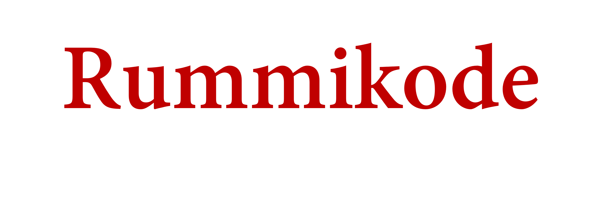

A codingame multiplayer game project inspired by the famous board game [Rummikub](https://en.wikipedia.org/wiki/Rummikub)

You can try play online [here](https://www.codingame.com/contribute/view/25063d28cb5fb9c697257bc35536340919659), definitly the best way to play it.

If you want to run it on your local machine,
 - Download the latest release
 - Unzip the archive
 - run `src\test\java\SkeletonMain.java` with JDK 1.8 (or higher) and Maven installed. After it ran, open ` http://localhost:8888/test.html`  to watch the game.

For more information, check the [codingame doc](https://www.codingame.com/playgrounds/25775/codingame-sdk-documentation/game-runner)

